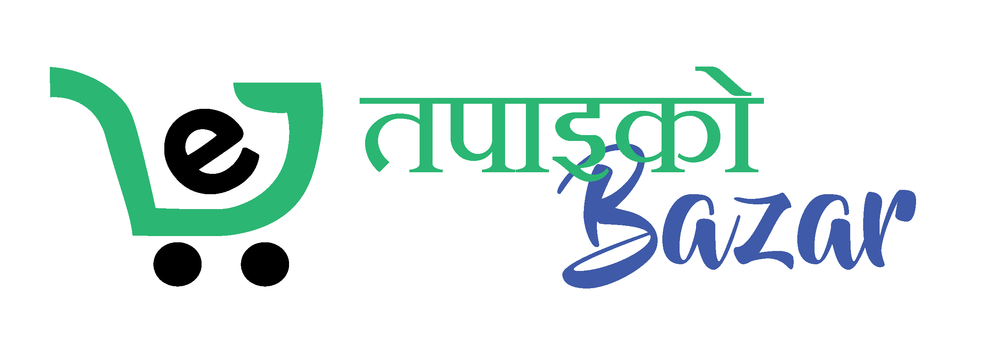

<div align="center">
  
</div>

<div align="center">
  <h2>🎓 CSIT Student | 💻 Full Stack Developer | 🤖 AI Enthusiast</h2>
  <p align="center">
    
  </p>
  
  <p>
    <a href="https://linkedin.com/in/utsargamanandhar"></a>
    <a href="mailto:contact@utsargamanandhar.com.np"></a>
    <a href="https://utsargamanandhar.com.np"></a>
  </p>

  <p>📍 Kathmandu, Nepal | 🌏 Creating for the world</p>
</div>

---

### 🚀 About Me

I'm a **Full Stack Engineer** specializing in the MERN stack with a focus on **AI/ML integration**. Currently finishing my **CSIT degree** (8th Sem), I bridge the gap between robust web architecture and intelligent systems.

- 🔭 **Current Focus:** AI-integrated SaaS & Scalable Architectures
- 📚 **Learning:** Advanced System Design & LLM Fine-tuning
- ⚡ **Fun Fact:** I believe every complex problem has a clean, elegant solution waiting to be coded.

---

### 🛠️ Tech Stack

<div align="center">
  <table border="0">
    <tr>
      <td align="center" width="200"><strong>Frontend</strong></td>
      <td align="center" width="200"><strong>Backend</strong></td>
      <td align="center" width="200"><strong>Database</strong></td>
      <td align="center" width="200"><strong>AI & Tools</strong></td>
    </tr>
    <tr>
      <td align="center">
        
      </td>
      <td align="center">
        
      </td>
      <td align="center">
        
      </td>
      <td align="center">
        
      </td>
    </tr>
  </table>
</div>

---

### 🌟 Featured Projects

<div align="center">

| 🅿 SocialSphere | 🧳 Messayo |
| :---: | :---: |
|  |  |
| AI-Moderated Social Platform | Real-Time WebSocket Chat |
| [Code](https://github.com/hilubabz/SocialSphere) • [Live](https://socialsphere.utsargamanandhar.com.np/) | [Code](https://github.com/hilubabz/Messayo) |

| 🛒 HavocAura | 🥗 Tapaiko Bazar |
| :---: | :---: |
|  |  |
| PC Parts E-Commerce & Builder | AI-Powered Marketplace |
| [Code](https://github.com/hilubabz/HAVOCAURA) | [Code](https://github.com/nabinshrestha024/ecommerce) |

</div>

---

### 📈 GitHub Contributions


<br/>

<div align="center">
  
  
</div>

<div align="center">
  
</div>

---

### 💼 Current Status

```javascript
const developer = {
  name: "Utsarga Manandhar",
  status: "Open to Opportunities",
  stack: ["MERN", "Next.js", "AI/LLM"],
  philosophy: "Build, Learn, Scale",
  isAvailableForHire: true
};
```

<div align="center">
  
</div>
